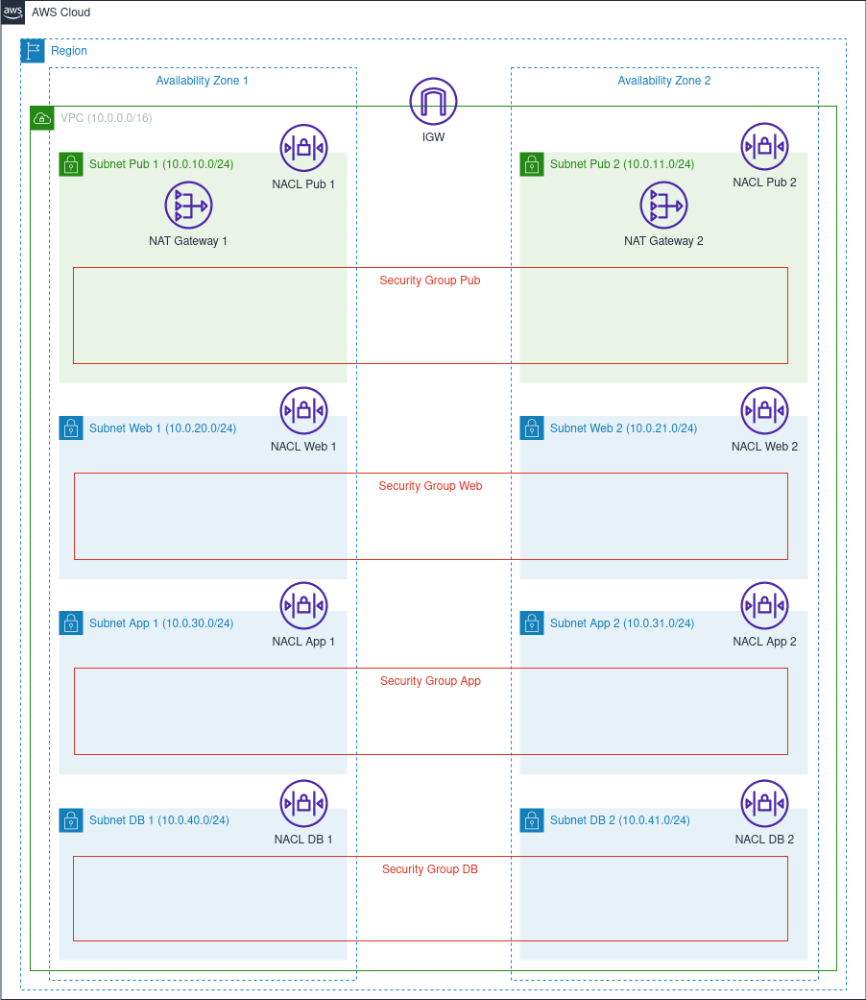

# Terraform AWS Multi-AZ VPC
The [main.tf](./main.tf) Terraform script creates the network resources for a virtual private cloud (VPC) with public access, web, application, and database tiers.  Components include an internet gateway (IGW) and redundant NAT gateways; public and private subnets spread over two Availability Zones (AZ), with route tables for each subnet; network access control lists (NACL) to secure inbound and outbound subnet traffic; and security groups for the instances in each tier.

The architectural diagram below shows the resources created by the script.



Before launching the script, review the resources that will be created, as the NAT gateways are not free tier eligible. Please refer to the [Amazon VPC Pricing](https://aws.amazon.com/vpc/pricing/) page for specific regional pricing.  

## Script Overview
The [main.tf](./main.tf) script creates the AWS resources described below.

### VPC
One (1) VPC, spanning across two AZs (AZ1 and AZ2), is generated. The VPC contains all of the network resources created by the script.

Traffic flow is designed with the expectation that bastion hosts and load balancers will be placed in the public access tier subnets; EC2 instances, EKS clusters, or Lambda functions in the web and application tier subnets; and RDS MySQL instances in the database tier subnets.

### IGW and NAT Gateways 
The script creates one (1) IGW, which enables resources in the public subnets to reach the internet. To provide internet access for the private subnets, two (2) NAT gateways are created, with one (1) placed in each AZ for redundancy. 

### Public and Private Subnets
Two (2) public subnets are created, one (1) in each AZ. Six (6) private subnets are generated, two (2) in each of the web, application, and database tiers, spread across the two (2) AZs. 

To control traffic flow, route tables are created for each subnet. The route tables for the public access subnets each contain a route to the IGW, while the route tables for the web and application tier subnets each contain a route to the NAT gateway in their respective AZ. The route tables for the database tier subnets do not contain routes to the NAT gateway, primarily because hosted services such as AWS RDS do not require internet access for updates. These initial routes should be modified as circumstances dictate.

### NACLs
Eight (8) NACLs are configured to limit ingress and egress only to adjacent tier subnets in the same AZ. For example, Subnet App 1 can only send and receive traffic to and from Subnet Web 1 and Subnet DB 1. Ingress and egress are restricted by IP range and port.

For Subnet Pub 1 and Subnet Pub 2, ingress and egress outside the VPC is currently restricted to a placeholder private IP address range (192.168.0.0/16) on SSH port 22. If public facing resources are added to these subnets, such as bastion hosts or load balancers, the allowed IP ranges and ports should be updated accordingly.

### Security Groups
A total of four (4) security groups are generated. Each security group functions as a firewall for the instances in each tier of subnets, limiting ingress and egress to instances in adjacent tier security groups.

For example, the application tier security group (Security Group App) allows ingress traffic only on port 443 from instances in the web tier security group (Security Group Web). Egress is limited to port 3306 traffic destined for instances in the database tier security group (Security Group DB). Because security groups are stateful, response traffic is allowed for each of these rules.

## Terraform Local Modules
Terraform local modules are invoked by [main.tf](../main.tf) to create the AWS resources listed above. Following Terraform best practices, each module directory includes `main.tf`, `variables.tf`, `outputs.tf`, `providers.tf`, and `README.md` files. The modules, along with their locations and descriptions, are listed below.

|Module|Location|Description|
|------|--------|-----------|
|nacl|[modules/nacl](./modules/nacl)|Terraform module to provision an AWS network access control list.|
|nacl_rule|[modules/nacl_rule](./modules/nacl_rule)|Terraform module to provision an AWS network access control list rule.|
|nat|[modules/nat](./modules/nat)|Terraform module to provision an AWS NAT gateway.|
|rt|[modules/rt](./modules/rt)|Terraform module to provision an AWS route table.|
|sg|[modules/sg](./modules/sg)|Terraform module to provision an AWS security group.|
|sg_rule|[modules/sg_rule](./modules/sg_rule)|Terraform module to provision an AWS security group rule.|
|subnet|[modules/subnet](./modules/subnet)|Terraform module to provision an AWS subnet.|
|vpc|[modules/vpc](./modules/vpc)|Terraform module to provision an AWS virtual private cloud with an internet gateway.|

## Getting Started

### Dependencies

+ Terraform (For installation instructions, [click here](https://developer.hashicorp.com/terraform/tutorials/aws-get-started/install-cli)
+ AWS CLI (For installation instructions, [click here](https://docs.aws.amazon.com/cli/latest/userguide/getting-started-install.html)
+ Established connection to an AWS account

### Installation
To install the script, either clone the [terraform-aws-vpc](.) repo or download the files to the local host. 

## Usage
To run the script, follow standard Terraform practices by navigating to the directory that holds the `main.tf` script and running the commands to initialize and apply the script:

```bash
terraform init
terraform plan
terraform apply
```

## License

Licensed under the [GNU General Public License v3.0](./LICENSE).
